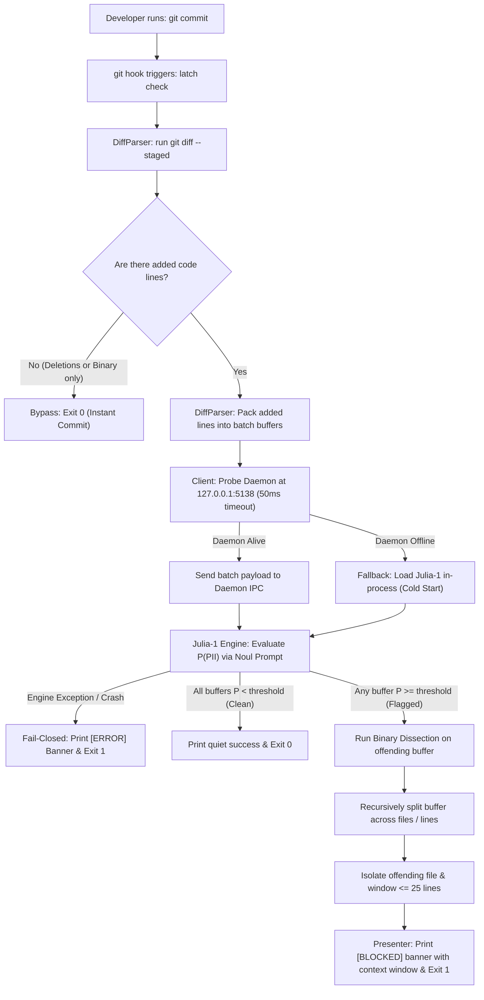

# Latch — Technical Specification

## How This Works, In Plain Language

**Latch** is a local security checkpoint that runs every time you type `git commit`. 

Instead of sending your private code changes to a slow, expensive cloud AI service or relying on fragile regular expressions that only recognize exact keywords, Latch inspects your staged additions right on your laptop using **Julia-1** — an ultra-compact (144M parameter), non-autoregressive decision model running locally on your CPU.

Here is how the pieces work together:
1. **The Gate**: A git pre-commit hook script intercepts your commit before it is saved.
2. **The Filter**: Latch checks if the commit contains actual code additions. If you only deleted lines or added binary assets (like PNGs), Latch approves the commit immediately in 0ms.
3. **The Fast Path (Batch Packing)**: If you touch 50 different files with tiny edits, Latch does not run 50 separate AI queries. It packs the added lines from all files into a single context buffer and runs **one single check**. On clean code, this passes in **~33ms**, and your commit finishes seamlessly.
4. **The Pinpoint Path (Binary Dissection)**: If Latch senses leaked PII or credentials in that batch, it does not just say "something is wrong." It divides the changes in half and re-checks each half, repeating this until it zooms in on the exact file and a tight window of $\le 25$ lines.
5. **The Two-Tier Runner (Speed + Reliability)**:
   - If the **Latch background daemon** is running, the hook talks to it over local loopback in milliseconds (keeping the model warm in RAM with zero startup lag).
   - If the daemon is **not running**, Latch does not fail or crash — it smoothly falls back to evaluating in-process (cold start). It takes ~1 second to load the weights, but still inspects the code thoroughly and blocks leaks.
6. **Strict Fail-Closed**: If the model file is missing or corrupted, Latch strictly halts the commit with a clear error banner. It never silently lets uninspected code slip through.

---

## The Core Journey Through the System

Implements `prd.md > The Core Journey`.



### Trace Step-by-Step

1. **Invocation**: The developer runs `git commit -m "update user model"`.
2. **Hook Execution**: Git executes `.git/hooks/pre-commit`, which calls `latch check`.
3. **Extraction & Filtering**: `DiffParser` runs `git diff --staged --no-ext-diff --no-color`. If the diff has zero added lines (e.g. pure deletions or binary files), the command exits `0` immediately.
4. **Batch Buffer Assembly**: `DiffParser` strips hunk headers and unchanged context, packing added lines (`+`) into formatted blocks (`=== File: <path> ===`) up to `max_chunk_tokens` (default 750 tokens).
5. **Execution Routing**:
   - `Client` performs a 50ms socket probe to `http://127.0.0.1:5138/v1/health`.
   - If responsive: `Client` sends a POST request with the batch payload to the daemon.
   - If unreachable: `Client` initializes `JuliaEngine` directly in-process.
6. **Evaluation**: Julia-1 evaluates the wrapped `<code_diff_payload>` against the Noul prompt template and returns calibrated probability $P$.
7. **Resolution**:
   - **$P < \tau$ (Clean)**: All batches pass. Exit code `0`. Commit completes in < 50ms (warm).
   - **$P \ge \tau$ (Leak Detected)**: Latch enters binary dissection. It splits the offending buffer into halves $A$ and $B$, re-evaluating each branch until it isolates the specific file and a context window $\le 25$ lines. Terminal prints a bold `[BLOCKED]` banner showing the snippet, file, and line range. Exit code `1`.
   - **Engine Error**: If weights are missing or unreadable, `Presenter` prints an explicit `[ERROR]` diagnostic. Exit code `1` (fail-closed).

---

## Stack

| Layer / Dependency | Technology / Version | Documentation Link | Selection Rationale & Tradeoffs |
| :--- | :--- | :--- | :--- |
| **Language** | Python 3.12.x | [Python 3.12 Docs](https://docs.python.org/3.12/) | First-class ecosystem support for Hugging Face weights, cross-platform process management, and rich CLI ergonomics. |
| **ML Engine / Framework** | Julia-1 native runtime (`torch` >=2.2, CPU build; installed via `pip install -e ./models/julia-1`) | [Julia-1 Model Card](https://huggingface.co/SupersonicLabs/Julia-1) / [PyTorch CPU](https://pytorch.org/get-started/locally/) | Julia-1 ships its own Python package (`from julia import load_model`). It is **not** a HuggingFace `AutoModel` / `transformers` pipeline — the README explicitly states this. `torch` is the underlying tensor library; the `transformers` package is not required. |
| **Model Weights** | `SupersonicLabs/Julia-1` (~550 MB) | [Julia-1 Model Card](https://huggingface.co/SupersonicLabs/Julia-1) | CPU-native System-1 non-autoregressive decision model. Delivers ~33ms Noul binary classification on CPU without cloud latency or GPU overhead. Context window: **8,192 tokens** (runtime `max_length`). Historical benchmarks used 1,024 tokens. |
| **IPC Daemon Server** | Python Standard Library (`http.server.ThreadingHTTPServer`, `urllib.request`) | [Python http.server Docs](https://docs.python.org/3.12/library/http.server.html) | Zero third-party web framework dependencies. `ThreadingHTTPServer` (stdlib) handles concurrent hook invocations without blocking — critical when IDE tooling or git GUIs fire parallel commits. |
| **CLI / Packaging** | Python `argparse` & `setuptools` | [Python argparse Docs](https://docs.python.org/3.12/library/argparse.html) | Built-in CLI parser. Zero extra dependencies for the CLI entry point. |
| **Configuration** | Standard JSON (`json` stdlib) | [Python json Docs](https://docs.python.org/3.12/library/json.html) | Clean, human-editable, git-friendly `config.json` externalizing all operational parameters. |

---

## Where It Runs and How Someone Tries It

### Runtime Environment
- **Platform**: Windows 10/11, macOS, or Linux.
- **Python**: Python 3.12+ (standard virtual environment).
- **Hardware**: Standard x86_64 or ARM64 CPU. No GPU required. ~1 GB free RAM for daemon.
- **Git**: Git 2.25+ installed and on system PATH.

### Installation & Quick Start

1. **Clone & Virtual Environment**:
   ```bash
   git clone <repo-url>
   cd <project-directory>
   python -m venv .venv
   # Windows PowerShell:
   .venv\Scripts\Activate.ps1
   # Linux / macOS:
   source .venv/bin/activate
   pip install -r requirements.txt
   ```

2. **Download Model Weights**:
   ```bash
   python -m latch.cli download-model
   ```

3. **Install Hook**:
   ```bash
   python -m latch.cli install
   ```
   *(Installs `.git/hooks/pre-commit` with the **absolute path** to the virtualenv's Python interpreter, e.g. `/abs/path/.venv/bin/python -m latch.cli check`. Using a bare `python` alias is unsafe — IDE terminals and git GUI clients may not activate the virtualenv, causing the hook to silently use the wrong interpreter.)*

4. **Start the Warm Daemon (Optional, for < 50ms commits)**:
   ```bash
   python -m latch.cli daemon start
   ```

5. **Demo Recording Verification Steps**:
   - **Step 1 (Clean Commit)**: Stage a clean file (`git add clean.py && git commit -m "clean"`). Verify commit passes instantly in < 50ms.
   - **Step 2 (Blocked Commit)**: Stage a file with real PII/secret (`git add leak.py && git commit -m "leak"`). Verify hook aborts with exit code `1` and prints `[BLOCKED]` with the isolated $\le 25$-line window.
   - **Step 3 (Fail-Closed Verification)**: Temporarily rename the model folder and attempt a commit. Verify hook halts with exit code `1` and prints `[ERROR]` diagnostic banner.

### Manual Hook Installation (README Fallback)
If developers do not use `latch install`, they create `.git/hooks/pre-commit` **using the absolute path to the virtualenv interpreter**:
```bash
#!/bin/sh
# Replace with your actual absolute virtualenv path:
/home/user/project/.venv/bin/python -m latch.cli check
```
and ensure executable permissions (`chmod +x .git/hooks/pre-commit`).

> **Warning**: Never use a bare `python` alias here. The hook runs in a minimal shell environment where the virtualenv is not activated, so a bare `python` will resolve to the system interpreter, which does not have `latch` installed.

---

## Look and Feel

Implements `scope.md > Inspiration & Identity` and clean terminal output guidelines:
- **Quiet on Clean**: When code is clean, Latch prints zero noise or at most a single subdued monospace line: `✓ Latch: Clean (28ms)`.
- **High-Contrast on Blocked**: When PII is detected, Latch displays a bold, framed ANSI alert banner:
  ```text
  ┌─────────────────────────────────────────────────────────────┐
  │ [LATCH BLOCKED] Sensitive PII or Credentials Detected       │
  └─────────────────────────────────────────────────────────────┘
  File:   src/services/user_service.py
  Lines:  42-56 (Pinpointed window: 14 lines)
  Reason: PII confidence 0.89 >= threshold 0.65

  Context Window:
  42 | def get_customer():
  43 |     # Test customer profile
  44 |     customer_name = "Jane Doe"
  45 |     customer_phone = "+1-415-555-2671"
  46 |     customer_ssn = "000-12-3456"

  Commit aborted. Remove sensitive data or stage clean changes before committing.
  ```
- **Explicit on Error (Fail-Closed)**:
  ```text
  ┌─────────────────────────────────────────────────────────────┐
  │ [LATCH SYSTEM ERROR] Evaluation Aborted (Fail-Closed)       │
  └─────────────────────────────────────────────────────────────┘
  Error: Julia-1 model weights not found at './models/julia-1'.
  Action: Run 'latch download-model' or verify config.json 'model_path'.
  ```

---

## Components

### 1. CLI & Hook Orchestrator (`src/latch/cli.py`)
Implements `prd.md > Pre-Commit Interception & Diff Filtering`.
- **Role**: Main process entry point for all commands (`check`, `install`, `daemon`, `benchmark`, `download-model`).
- **Interfaces**: Dispatches arguments to `Client`, `DaemonManager`, or `BenchmarkRunner`.
- **Exit Code Contract**: Returns `0` on clean diffs; returns `1` on detected leaks or system errors.

### 2. Fast Client & Fallback Handshake (`src/latch/client.py`)
Implements `prd.md > Features and Behavior > 4. Strict Fail-Closed Error Enforcement`.
- **Role**: Coordinates the evaluation workflow between staged diffs and the engine.
- **Logic**:
  1. Requests parsed diff batches from `DiffParser`.
  2. Probes `http://127.0.0.1:5138/v1/health` with a 50ms timeout.
  3. If daemon is up, POSTs batch payload.
  4. If daemon is down, invokes `JuliaEngine` in-process (cold start).
  5. If engine returns $P \ge \tau$, invokes binary dissection on `DiffParser`.
  6. Passes outcome to `Presenter` and returns exit code.

### 3. Local Warm Daemon (`src/latch/daemon.py`)
Implements `prd.md > Technical & Engine Strategies > Julia-1 Engine Interface Contract`.
- **Role**: Long-running background process that loads Julia-1 weights once into RAM and serves local evaluation requests.
- **Implementation**: `http.server.ThreadingHTTPServer` bound strictly to `127.0.0.1:5138`. The threading variant is required to handle concurrent requests from parallel git hook invocations without blocking.
- **Endpoints**:
  - `GET /v1/health` → `{"status": "ready", "model": "Julia-1"}`
  - `POST /v1/evaluate` → receives `{"state": "...", "request_id": "<uuid4>"}`, returns `{"probability": 0.89, "latency_ms": 32, "request_id": "...", "error": null}`
  - `POST /v1/shutdown` → clean daemon exit.
- **PID Management**: Records PID to `.latch/daemon.pid` for clean lifecycle management on Windows/Linux.

### 4. Diff Parser & Batch Slicer (`src/latch/diff_parser.py`)
Implements `prd.md > Features and Behavior > 1. Pre-Commit Interception` & `2. Adaptive Batching & Binary Dissection`.
- **Role**: Pure functional module for git diff inspection and manipulation.
- **Responsibilities**:
  - Executes `git diff --staged --no-ext-diff --no-color`.
  - Filters out binary files and pure deletion hunks.
  - Formats added lines (`+`) into structured file blocks: `=== File: <path> ===`.
  - Packs blocks into buffers up to `max_chunk_tokens`.
  - Splits single files exceeding token budget into sequential non-overlapping chunks.
  - Implements `bisect_buffer(buffer)`: splits a batch in half by file boundaries or line numbers.
  - Implements **conservative fallback**: if a split produces two halves where neither has $P \ge \tau$, returns the parent window.

### 5. State Builder & Data Isolator (`src/latch/prompt.py`)
Implements `prd.md > Features and Behavior > 3. Prompt Injection Defense & Data Isolation`.
- **Role**: Constructs the structured `state` string and `noul` question dict passed to Julia-1's `engine.predict()` API.
- **Responsibilities**:
  - Formats added lines into a clean `state` string (structured file blocks: `=== File: <path> ===\n+ <line>...`), loaded from `templates/noul_state.txt`.
  - Passes code content as the `state` argument and the PII detection question as a separate `questions` dict — these are **structurally isolated fields** in Julia-1's native API, not concatenated text.
  - **Injection Defence (Architectural)**: Julia-1's non-autoregressive architecture provides inherent resistance to prompt injection. Unlike autoregressive LLMs, it cannot be redirected by instructions embedded within the `state` payload — it scores fixed answer options, not open-ended text generation. The structural separation of `state` (code content) from `questions` (classification task) reinforces this boundary.
  - Injects few-shot contrastive examples into the `noul` question's `criteria` descriptions (benign mock descriptions vs. real PII patterns), loaded from `fixtures/noul_criteria.json`.

### 6. Julia-1 Decision Engine (`src/latch/engine.py`)
Implements `prd.md > Technical & Engine Strategies > Julia-1 Engine Interface Contract`.
- **Role**: Wraps the Julia-1 native runtime (`from julia import load_model`) for CPU inference. **Not** a HuggingFace `AutoModel` pipeline — Julia-1 ships its own Python package installed as `pip install -e ./models/julia-1`.
- **Interface**:
  ```python
  class JuliaEngine:
      def evaluate(self, state: str) -> EvaluationResult:
          # Calls: self._engine.predict(
          #     state=state,
          #     questions={"pii_check": {"type": "noul", "criteria": {...}}}
          # )
          # Returns EvaluationResult(probability=float, latency_ms=int)
          # Raises JuliaEngineError on missing weights, OOM, or inference failure
  ```
- **Loading**: `load_model(model_path, device="cpu", strict_encoding=True, max_length=8192)` — called once at daemon startup or cold-start. `max_length=8192` matches the verified runtime context window.
- **Calibration**: Julia-1's `noul` primitive returns a full softmax probability for the `true` label, giving a calibrated $P(\text{PII}) \in [0.0, 1.0]$.

### 7. Terminal Presenter (`src/latch/presenter.py`)
Implements `prd.md > Architectural & Clean Code > Layered Architecture (Presentation Layer)`.
- **Role**: Formats human-readable CLI outputs, ANSI high-contrast banners, and localized $\le 25$-line context snippets.
- **Guarantees**: Zero hardcoded strings in engine or parser logic; all terminal visuals are isolated here.

### 8. Configuration Manager (`src/latch/config.py`)
Implements `prd.md > Architectural & Clean Code > 2. Zero Hardcoding`.
- **Role**: Loads, validates, and provides type-safe access to `config.json`.
- **Schema Validation**: Ensures all operational parameters (threshold, token limits, window lines, port) exist with valid ranges and fallback defaults.

### 9. Benchmark & Evaluation Suite (`tests/run_benchmark.py`)
Implements `prd.md > Features and Behavior > 5. Benchmark & Evaluation Suite`.
- **Role**: Standalone harness running external datasets in `fixtures/` against the decision engine.
- **Output**: Reports Accuracy, False Negative Rate (FNR), False Positive Rate (FPR), Injection Resilience, Dissection Accuracy, and Mean Latency (with hardware baseline).

---

## Data Model

### 1. Configuration Schema (`config.json`)
```json
{
  "$schema": "http://json-schema.org/draft-07/schema#",
  "config_version": "1.0",
  "model": "SupersonicLabs/Julia-1",
  "model_path": "./models/julia-1",
  "model_max_context_tokens": 8192,
  "pii_threshold": 0.65,
  "max_chunk_tokens": 750,
  "max_dissection_depth": 15,
  "localization_window_lines": 25,
  "daemon_port": 5138,
  "daemon_probe_timeout_ms": 50,
  "noul_state_template_path": "./templates/noul_state.txt",
  "noul_criteria_path": "./fixtures/noul_criteria.json",
  "benchmark_fixtures_dir": "./fixtures/"
}
```

> **Schema note**: `ConfigManager` validates `max_chunk_tokens ≤ model_max_context_tokens` at startup and rejects mismatches. `config_version` is checked on load; a mismatch prints an upgrade prompt. `max_dissection_depth` caps recursion to prevent unbounded loops on pathological diffs.

### 2. IPC Request & Response Payloads
- **Daemon Evaluate Request (`POST /v1/evaluate`)**:
  ```json
  {
    "state": "=== File: src/auth.py ===\n+ const token = 'sk-live-12345'",
    "request_id": "a3f1c2d4-7e8b-4a0f-9c6d-1b2e3f4a5b6c"
  }
  ```
  The `state` field carries the formatted diff text passed directly to `engine.predict(state=...)`. The `request_id` is a **UUID4** generated at batch creation time, used to correlate concurrent requests through the daemon.

- **Daemon Evaluate Response**:
  ```json
  {
    "request_id": "a3f1c2d4-7e8b-4a0f-9c6d-1b2e3f4a5b6c",
    "probability": 0.941,
    "latency_ms": 31,
    "error": null
  }
  ```

### 3. Internal Diff Hunk Data Structures
```python
@dataclass(frozen=True)
class AddedLine:
    file_path: str
    line_number: int
    content: str

@dataclass
class DiffBatch:
    batch_id: str          # UUID4, e.g. str(uuid.uuid4()) — generated at batch creation
    lines: list[AddedLine]
    estimated_tokens: int

@dataclass
class DissectionResult:
    offending_file: str
    start_line: int
    end_line: int
    snippet: str
    probability: float
```

---

## File Structure

```text
<project-root>/
├── config.json                 # Operational parameters (thresholds, token limits, port)
├── .env.example                # Clean environment template (no secrets required for local)
├── requirements.txt            # Python dependencies (torch, transformers, etc.)
├── README.md                   # Installation, daemon guide, and manual hook documentation
├── devpost/                    # Planning artifacts
│   ├── learner-profile.md
│   ├── scope.md
│   ├── prd.md
│   └── spec.md                 # This document
├── fixtures/                   # Evaluation fixtures (strictly separated from source code)
│   ├── clean_samples/          # Benign test code and legitimate mock fixtures
│   │   ├── sample_user_mock.py
│   │   └── sample_auth_clean.ts
│   ├── pii_samples/            # Synthetic PII, addresses, phone numbers, fake keys
│   │   ├── leaked_customer_record.py
│   │   └── hardcoded_secret.env
│   └── adversarial_samples/    # Prompt injection attempts embedded in code comments
│       └── bypass_comment_injection.py
├── templates/
│   └── noul_prompt.txt         # Noul prompt template with <code_diff_payload> delimiters
├── src/
│   └── latch/
│       ├── __init__.py
│       ├── cli.py              # CLI entry point: install, check, daemon, benchmark
│       ├── config.py           # Validated config.json loader
│       ├── daemon.py           # Local HTTP loopback daemon keeping Julia-1 in RAM
│       ├── client.py           # Fast hook orchestrator with 50ms daemon probe & fallback
│       ├── diff_parser.py      # Git diff extraction, batch packing, binary dissection
│       ├── prompt.py           # Delimited prompt construction & contrastive mock injection
│       ├── engine.py           # Local Julia-1 Noul inference engine (CPU)
│       └── presenter.py        # Terminal formatting for [PASS], [BLOCKED], [ERROR]
├── scripts/
│   └── windows/                # Windows PowerShell daemon management scripts
│       ├── start-daemon.ps1    # Starts daemon in detached background job
│       ├── stop-daemon.ps1     # Stops daemon and removes PID file
│       └── status-daemon.ps1   # Checks port 5138 health
└── tests/
    ├── test_diff_parser.py     # Unit tests for batching and binary dissection slicing
    ├── test_fail_closed.py     # Verification that engine failure strictly exits 1
    └── run_benchmark.py        # Automated FNR, FPR, injection resilience evaluation
```

---

## External Services and Dependencies

- **Cloud APIs**: **None.** 100% zero-trust on-device execution. No network requests are made during git commits.
- **Model Checkpoint**: Downloaded once during setup from Hugging Face:
  - Repository: `SupersonicLabs/Julia-1`
  - Architecture: `mmBERT-small` (144.3M parameters)
  - License: Apache 2.0 (Open Weights)
  - Disk size: ~550 MB
  - URL: <https://huggingface.co/SupersonicLabs/Julia-1>

---

## Important Failure Modes

| Failure Mode | Root Cause | System Response (Strict Fail-Closed) | User Experience |
| :--- | :--- | :--- | :--- |
| **Daemon Unreachable** | Background daemon process stopped or not yet started | Client probes port 5138, times out after 50ms, and **gracefully falls back to cold-start evaluation in-process**. | Commit takes hardware-dependent cold-start time instead of ~33ms, but evaluation is completed accurately and securely. |
| **Model Weights Missing / Corrupt** | Model weights directory `./models/julia-1` deleted or incomplete | `JuliaEngine` catches missing file error, logs diagnostic, and **aborts the commit with exit code `1`**. | Explicit terminal error: `[LATCH SYSTEM ERROR] Julia-1 model weights missing. Run 'latch download-model'.` |
| **Dissection Ambiguity (PII spans split line)** | Sensitive data spans the exact boundary between two dissected halves, causing both to score $P < \tau$ | Dissection detects no child half exceeded threshold, **triggers conservative fallback and returns the parent window**. | The commit is still blocked with exit code `1`; developer is shown the enclosing $\le 50$-line parent window. |
| **`git` not on PATH** | `git` binary missing or not installed (CI runner, Docker image, fresh system) | `DiffParser` pre-flight check detects `git` is absent before running `git diff`, **aborts with exit code `1`**. | Explicit terminal error: `[LATCH SYSTEM ERROR] 'git' not found on PATH. Install Git 2.25+ and ensure it is on system PATH.` |
| **Not a git repository** | `latch check` run outside a git repository (e.g., manual invocation in wrong directory) | `DiffParser` pre-flight check detects missing `.git` directory, **aborts with exit code `1`**. | Explicit terminal error: `[LATCH SYSTEM ERROR] Not a git repository. Run 'latch check' from within a git-tracked project.` |

---

## What Was Simplified and Why

- **Julia-1 Native Runtime instead of Transformers AutoModel**: Julia-1 ships its own Python package (`from julia import load_model`) and is not a drop-in `AutoModel`/`transformers` pipeline. Using the native runtime avoids mismatched tokenizer assumptions and uses Julia-1's built-in structured `predict(state, questions)` API directly, which provides the calibrated `noul` probability we require.
- **Local HTTP Loopback instead of Named Pipes / UNIX Domain Sockets**: Built standard library HTTP loopback (`127.0.0.1:5138`) because Windows named pipes and UNIX domain sockets require platform-specific code and extra dependencies. HTTP loopback is universally cross-platform, trivial to probe, and adds < 2ms latency.
- **Single Noul Binary Decision instead of Multi-Class Categorization**: The POC focuses strictly on the binary reflex gate ("Is there sensitive PII/secrets? YES or NO") rather than identifying whether the leak is a phone number vs. an API key. Multi-class labeling would require secondary Choice queries and slows down the pre-commit gate.
- **Sequential Dissection instead of Concurrent Multi-Worker Dissection**: Dissection evaluates split halves sequentially because Julia-1 inferences take ~33ms each, meaning 4 steps take ~130ms on rejections. Multi-threading is unnecessary complexity for the POC.

---

## Decisions and Open Issues

### Key Decisions
1. **Engine Selection**: Julia-1 on CPU instead of Laya (requires GPU) or Jev (cloud API). Zero hardware prerequisites for developers.
2. **Two-Tier Execution Posture**: Daemon for < 50ms performance; automatic in-process cold-start fallback when daemon is offline.
3. **Conservative Dissection Fallback**: If splitting a flagged buffer produces two halves that both test clean, the parent buffer is reported. Eliminates false negatives caused by split boundaries.
4. **Clean Code & Modular Sizing**: Every file under `src/latch/` is strictly scoped to < 500 lines with zero hardcoded parameters (`config.json` is the sole source of truth).

### One Useful Unknown: Dissection Split-Boundary Verification
- **The Question**: Does binary dissection reliably catch multi-line PII (e.g. 3-line address or formatted PEM certificate block) when the line split falls directly in the middle of the sensitive data?
- **Investigation Planned for `5-build`**:
  - We will create an explicit test fixture in `fixtures/pii_samples/split_boundary_pii.txt` where a multi-line address sits on the exact midpoint line of a batch.
  - We will assert that the conservative fallback activates as specified and correctly isolates the parent window with exit code `1`.

### Open Issues / Future Work
- Evaluation of Julia-1 on older Intel/AMD CPU architectures to determine whether quantization (e.g. INT8 ONNX) is beneficial for older developer laptops.
